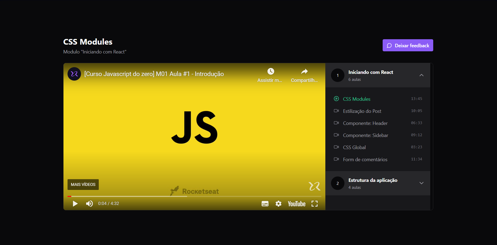

<h1 align="center">React + Redux + Zustand</h1>

Esse projeto foi realizado para desenvolvimento de habilidades de gerenciamento de estados usando duas ferramentas muito forte no mercado: Redux e Zustand. Cada uma delas tem suas peculiaridades e vantagens. O projeto é uma landing page com aulas de um curso
online.

OBS: O projeto final está realizado com Zustand, mas durante o desenvolvimento foi utilizado o Redux.

<br/>

# 🚀 Tecnologias

Projeto desenvolvido com as seguintes tecnologias:

- React JS
- TypeScript
- Tailwindcss
- Radix UI
- Redux
- Zustand
- Vitest
- Axios
- Git e Github

<br>

# 💻 Principais issues

- Desenvolvimento do design utilizando o Tailwindcss e RadixUI
- Conectando com o Redux
- Do Redux ao Zustand 
- Conectando uma API local com o json server

<br/>

<h2>Versão Desktop:</h2> 

<br/>

### Página Principal


# 👨‍💻 Usando Redux 

Uso do Redux na aplicação:
````` typescript
// Arquivo store/index.ts

// Criando um estado inicial para o playerSlice
const initialState: PlayerProps = {
  course: null,
  currentModuleIndex: 0,
  currentLessonIndex: 0,
  isLoading: true
}

// reducer do playerSlice que funciona de forma assíncrona
export const loadCourse = createAsyncThunk(
  "player/load",
  async ()=>{
     const response = await api.get("/courses/1")
     return response.data 
    }
)

// estado player contendo o nome do slice, seu estado inicial e os
// reducers (ações que poderão ser chamadas para alterar o estado)
export const playerSlice = createSlice({
  name: "player",
  initialState,
  reducers:{
    play: (state, action:PayloadAction<[number, number]>)=>{
      state.currentModuleIndex = action.payload[0]
      state.currentLessonIndex = action.payload[1]
    },
    next: (state)=>{
      const nextLessonIndex = state.currentLessonIndex + 1
      const nextLesson = state.course?.modules[state.currentModuleIndex].lessons[nextLessonIndex]

      if(nextLesson){
        state.currentLessonIndex = nextLessonIndex
      }else{
        const nextModuleIndex = state.currentModuleIndex + 1
        const nextModule = state.course?.modules[nextModuleIndex]

        if(nextModule){
          state.currentModuleIndex = nextModuleIndex
          state.currentLessonIndex = 0
        }
      }
    }
  },
  extraReducers(builder){
    builder.addCase(loadCourse.pending, (state)=>{
      state.isLoading = true
    })

    builder.addCase(loadCourse.fulfilled, (state, action)=>{
      state.course = action.payload
      state.isLoading = false
    })
  }
})

// Exportando o reducer/state e as actions para utilizar em outros arquivos
export const player = playerSlice.reducer
export const {play, next} = playerSlice.actions
`````

<br>

# 👨‍💻 Usando Zustand 

Uso do Zustand na aplicação. Perceba como é bem mais simples que o redux:
````` typescript
// Arquivo zustand-store/index.ts

// Criando um estado global (useStore) que tem todas as variáveis
// que são estados e métodos que realizam alterações nesses estados
export const useStore = create<PlayerProps>((set, get)=>{
  return {
    course: null,
    currentModuleIndex: 0,
    currentLessonIndex: 0,
    isLoading: true,

    load: async ()=>{
      set({isLoading:true})
      const response = await api.get("/courses/1")
      set({
        course: response.data,
        isLoading: false
      }) 
    },

    play: (moduleAndLessonIndex: [number, number])=>{
      const [moduleIndex, lessonIndex] = moduleAndLessonIndex
      set({
        currentLessonIndex: lessonIndex,
        currentModuleIndex: moduleIndex
      })
    },
    next: ()=>{
      const {currentLessonIndex, course, currentModuleIndex} = get()
      const nextLessonIndex = currentLessonIndex + 1
      const nextLesson = course?.modules[currentModuleIndex].lessons[nextLessonIndex]

      if(nextLesson){
        set({
          currentLessonIndex: nextLessonIndex
        })
      }else{
        const nextModuleIndex = currentModuleIndex + 1
        const nextModule = course?.modules[nextModuleIndex]

        if(nextModule){
          set({
            currentModuleIndex: nextModuleIndex,
            currentLessonIndex: 0
          })
        }
      }
    }
  }
})
`````

<br>

### Utilizei como principais ferramentas:


